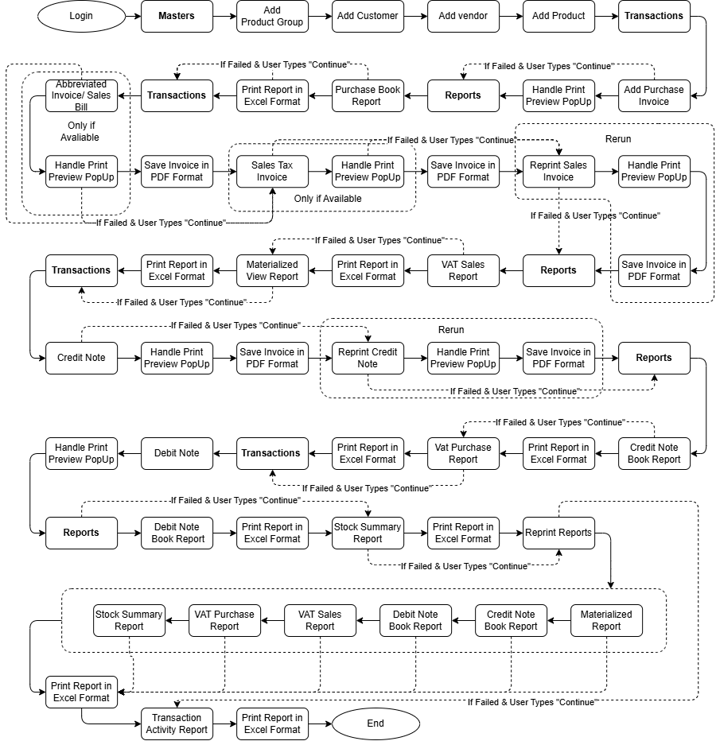

# Playwright-Practice-IMS — Automation Framework Documentation

## 1. Overview

| | |
|---|---|
| **Purpose** | End-to-end UI automation of the IRD (Inland Revenue Department) invoicing/reporting workflow for IMS/WebPOS |
| **Application under test** | `http://{env}.variantqa.himshang.com.np` (URL supplied at runtime) |
| **Language** | Python 3.10+ |
| **Automation library** | Playwright (sync API), `playwright==1.48.0` |
| **Test runner** | Pytest 9.x, run in **sequential, single-browser-session** style (not isolated per-test) |
| **Design pattern** | Page Object Model (POM), one class per screen/feature |
| **Reporting** | `pytest-html` report |
| **Author** | Sagan Krishna Tamrakar |

This is not a classic "one test = one independent scenario" suite. It automates a single **continuous business journey** — the full IRD tax-compliance flow of an IMS system, from login through creating masters, raising invoices, and pulling every necessary report — chained together into one long run (`test_ird_flow`).

---

## 2. Repository Structure

```
Playwright-Practice-IMS/
├── conftest.py                  # Pytest fixtures: config_data, browser, page
├── generate_pdf.py              # Standalone helper: renders an HTML invoice to PDF via headless Chromium
├── requirements.txt             # Dependency list (raw pip-freeze dump — see §8)
├── ReadMe.md                    # Original project README
├── Flow.png                     # Flow diagram of the automation, embedded below
├── customers.csv                # Log of customers created during runs
├── vendors.csv                  # Log of vendors created during runs
├── product_groups.csv           # Log of product groups created during runs
├── product_details.csv          # FIFO log (max 10 rows) of products created during runs
│
├── Pages/                       # Page Object Model classes
│   ├── Login.py                 # Login + "already logged in" popup handling
│   ├── invoice_reprint.py / reprint_invoice.py   # Reprint Credit Note / Sales Invoice, save PDF to invoices/
│   ├── Masters/                 # Add Category / Customer / Product / Product Group / Vendor / Bulk Price Change
│   ├── Transactions/            # Purchase Invoice, Sales Invoice, Abbreviated Invoice, Credit Note, Debit Note, Opening Stock
│   └── Reports/                 # Purchase/Sales/Credit/Debit book reports, VAT Sales & Purchase registers,
│                                 # Stock Summary, Transaction Activity, Materialized View
│
├── Tests/                       # Pytest test modules
│   ├── IRD_Flow/                # The main end-to-end IRD journey
│   │   ├── Test_execution.py    # Orchestrator: calls each numbered test in business order, with retry prompt
│   │   ├── printpreview.py      # close_print_preview(page) — dismisses Chrome's native print dialog
│   │   └──test_run_reports.py  # Batch re-run of all final reports (imported by Test_execution.py)
│   ├── Masters/                 # Standalone master-data tests (e.g. bulk price change) — hardcoded creds (not part of IRD flow)
│   └── Transactions/            # Standalone transaction tests (e.g. opening stock) — hardcoded creds (not part of IRD flow)
│
├── Reports/
│   └── report.html              # Generated pytest-html report (after a run)
├── downloads/                   # Excel (.xlsx) exports downloaded during report tests
├── invoices/                    # PDF copies of invoices/reprints (Sales Invoice, Credit Note, reprints)
├── scratch/                     # Developer scratch scripts and DOM dumps used for debugging locators
└── .pytest_cache/
```

---

## 3. How the Framework Runs

### 3.1 Fixtures (`conftest.py`)

- **`config_data`** *(session scope)* — Reads `--url`, `--username`, `--password`, `--customer-address`, `--vender-address` from CLI options; if any are missing, **prompts interactively** via `input()`. This means the suite is not fully non-interactive unless all five CLI flags are passed.
- **`browser`** *(session scope)* — Launches a single Chromium instance for the whole session, **headless by default** (`headless=True`), with `--kiosk-printing` and `--disable-print-preview` launch args so Chrome's native print dialog silently prints/saves rather than opening an interactive preview window.
- **`page`** *(function scope)* — Creates a browser **context** per test (with `accept_downloads=True`) and opens `config_data["url"]`.
  > ⚠️ The `context.close()` call at the end of this fixture is currently **commented out**. In practice this means contexts/pages are never explicitly closed by the fixture — they accumulate for the life of the browser session. See §9 for the implications.



### 3.2 Two ways this codebase is exercised

1. **Orchestrated end-to-end flow** — `Tests/IRD_Flow/Test_execution.py::test_ird_flow`
   Imports every numbered `test_XX_*` function from `Tests/IRD_Flow/` and calls them **in sequence, in one pytest test**, simulating a real user walking through the entire IRD compliance process. Skipping individual steps is supported via the `SKIP_TESTS` environment variable (see §4.5).
2. **Standalone/independent tests** — `Tests/Masters/test_10_bulk_price_change.py` and `Tests/Transactions/test_03_opening_stock.py`
   These are regular, independently runnable pytest tests with **hardcoded credentials** (`Testuser` / `Test@1234`) rather than pulling from `config_data`. They are not wired into `Test_execution.py`.

---

## 4. Running the Suite

### 4.1 Prerequisites

- Python 3.10+
- Git

### 4.2 Setup

```bash
git clone https://github.com/Unknown3369/Playwright-Practice-IMS.git
cd Playwright-Practice-IMS

# Create & activate a virtual environment
python -m venv venv
source venv/bin/activate        # Windows: venv\Scripts\activate

# Install Python dependencies
pip install -r requirements.txt

# Install the Chromium browser binary for Playwright
playwright install chromium
```
> ⚠️ `requirements.txt` is currently saved as **UTF-16** (a raw `pip freeze` redirect from PowerShell). `pip install -r requirements.txt` may fail to parse it as-is on some setups — re-save it as UTF-8 first if you hit a decode error. See §8 for more.

### 4.3 Run headed for debugging

The suite is **headless by default** now (`headless=True` in `conftest.py`). To watch the browser while debugging, edit the `browser` fixture:

```python
browser = p.chromium.launch(
    headless=False,
    args=["--kiosk-printing", "--disable-print-preview"],
)
```

### 4.4 Run the full IRD flow with an HTML report

```bash
pytest Tests/IRD_Flow/Test_execution.py -v --html=Reports/report.html --self-contained-html -s
```

You'll be prompted for `URL`, `Username`, `Password`, `Customer Address`, and `Vender Address` unless supplied via CLI flags:

```bash
pytest Tests/IRD_Flow/Test_execution.py \
  --url http://demo.variantqa.himshang.com.np \
  --username myuser \
  --password mypassword \
  --customer-address "Kathmandu" \
  --vender-address "Lalitpur" \
  -v --html=Reports/report.html --self-contained-html -s
```
> The Customer and Vendor addresses used in TC steps that create a Customer/Vendor master now come directly from these two flags/prompts, rather than being randomly generated (as they were in earlier versions of this suite).

> **Interactive failure prompt:** Most steps in `test_ird_flow` are now wrapped in a `run_test()` helper. If a step raises an exception, execution **pauses and prompts on the console**:
> ```
> Enter 'continue' to skip this test and continue
> or 'stop' to terminate execution:
> ```
> This means an unattended/CI run can hang indefinitely on a failure unless something is piping a response to stdin. Plan around this for automated pipelines (see §9).

### 4.5 Skip specific steps

Set the `SKIP_TESTS` environment variable to a comma-separated list of the internal step names, then rerun:

```powershell
# PowerShell (Windows)
$env:SKIP_TESTS="test_generate_credit_note,test_debit_note"
pytest Tests/IRD_Flow/Test_execution.py --reruns 2 -v --html=Reports/report.html --self-contained-html -s
```

```bash
# bash/Linux/macOS
export SKIP_TESTS="test_generate_credit_note,test_debit_note"
pytest Tests/IRD_Flow/Test_execution.py --reruns 2 -v --html=Reports/report.html --self-contained-html -s
```

Valid skip-names correspond to the identifiers checked in `Test_execution.py`: `test_login_to_ims`, `test_add_product_group_master`, `test_add_customer`, `test_create_vendor`, `test_add_prod`, `test_purchase_invoice`, `test_purchase_book_report`, `test_abbv_invoice`, `test_sales_invoice`, `test_reprint_sales_invoice`, `test_sales_book_report`, `test_vat_sales_register_report`, `test_materialized_view_report`, `test_generate_credit_note`, `test_reprint_credit_note`, `test_generate_credit_note_book_report`, `test_vat_purchase_register_report`, `test_debit_note`, `test_generate_debit_note_book_report`, `test_stock_summary_report`, `test_print_all_final_reports`, `test_transaction_activity_report`.

### 4.6 Run a standalone test

```bash
pytest Tests/Masters/test_10_bulk_price_change.py -v
pytest Tests/Transactions/test_03_opening_stock.py -v
```
These use hardcoded credentials `Testuser` / `Test@1234` and don't require `--url`/`--username`/`--password`/`--customer-address`/`--vender-address` — the `page` fixture will otherwise prompt for them interactively.

**Note:** Only tests under `Tests/Masters/` and `Tests/Transactions/` skip the CLI-flag requirement; everything under `Tests/IRD_Flow/` needs the full `config_data` set.

---

## 5. The IRD Flow — Business Steps in Order

`test_ird_flow` (in `Test_execution.py`) walks through the following sequence on a single logged-in session. Steps marked **[Print Preview]** are followed by a call to `close_print_preview()` (`printpreview.py`), which waits 20s then presses `Escape` to dismiss Chrome's native print dialog — a fallback in case `--kiosk-printing`/`--disable-print-preview` don't silently suppress it.

1. **Login** (`test_01_Login.py`) — logs in, and handles a "previous session" popup by clicking Sign out and retrying.
2. **Add Product Group** (`test_02_add_product_group.py`) — creates a master product group; logs it to `product_groups.csv`.
3. **Add Customer** (`test_04_add_customer.py`) — creates a customer master using the `--customer-address` supplied at runtime.
4. **Add Vendor** (`test_04_add_vendor.py`) — creates a vendor master using the `--vender-address` supplied at runtime; logs to `vendors.csv`.
5. **Add Product** (`test_03_add_prod.py`) — creates a product using the most recently added group/vendor; logs to `product_details.csv` (FIFO capped at 10 rows).
6. **Purchase Invoice [Print Preview]** (`test_05_purchase_invoice.py`) — raises a purchase invoice against the new vendor/product.
7. **Purchase Book Report** (`test_06_purchase_book_report.py`) — runs and downloads the report as an Excel file.
8. **Abbreviated Invoice [Print Preview]** (`test_07_abbv_invoice.py`) — generates an abbreviated sales bill.
9. **Sales Invoice [Print Preview]** (`test_07_sales_invoice.py`) — generates a full sales invoice; also renders/downloads a PDF via `generate_pdf.py` into `invoices/`.
10. **Reprint Sales Invoice [Print Preview]** (`test_reprint_sales_invoice.py`) — reprints the invoice **once**, saving a PDF to `invoices/`.
11. **Sales Book Report** (`test_08_sales_book_report.py`).
12. **VAT Sales Register Report** (`test_11_vat_sales_register_report.py`).
13. **Materialized View Report** (`test_09_materialized_report.py`).
14. **Credit Note [Print Preview]** (`test_10_credit_note.py`) — generates a credit note against the sales invoice.
15. **Reprint Credit Note [Print Preview]** (`test_reprint_credit_note.py`) — reprinted **once**, saving a PDF to `invoices/`.
16. **Credit Note Book Report** (`test_11_credit_note_report.py`).
17. **VAT Purchase Register Report** (`test_16_vat_purchase_report.py`).
18. **Debit Note [Print Preview]** (`test_14_debit_note.py`).
19. **Debit Note Book Report** (`test_15_debit_note_report.py`).
20. **Stock Summary Report** (`test_17_stock_summary_report.py`).
21. **Print All Final Reports** (`test_run_reports.py` → `test_print_all_final_reports`) — re-logs in, then re-runs and downloads Materialized View, Credit Note Book, Debit Note Book, VAT Sales Register, VAT Purchase Register, and Stock Summary reports, reloading the page (`page.reload(wait_until="networkidle")`) between each.
22. **Transaction Activity Report** (`test_18_transaction_activity_report.py`).

Report steps (7, 11–13, 16, 17, 19–21, 22) download an Excel file into `downloads/`.

> **Change from earlier revisions of this suite:** VAT Sales Register Report and Materialized View Report previously ran twice in the flow; they now each run exactly once. Reprint Sales Invoice and Reprint Credit Note previously looped 3×; they now loop once (`for i in range(1)` — a leftover loop construct that is effectively a no-op).

---

## 6. Page Object Model Conventions

- Every screen has a dedicated class in `Pages/<Area>/<name>.py` (`Masters`, `Transactions`, `Reports`, or top-level for shared screens like `Login`).
- Constructors take a Playwright `Page` and store it as `self.page`; most locators are defined as XPath strings in `__init__` (a carry-over from an earlier Selenium suite, per the code comments), though newer Report page objects mix in Playwright's built-in role/title locators (`get_by_role`, `get_by_title`).
- Business actions are exposed as methods (e.g. `perform_login`, `add_prod_test`, `save_button`, `generate_materialized_view_report`, `download_materialized_view_report`) that test modules call in sequence.
- All Master/Transaction/Report screens — including previously ad-hoc ones like **Add Category**, **Bulk Price Change**, and **Opening Stock** — now have dedicated Page Object classes (`Pages/Masters/add_category.py`, `Pages/Masters/bulk_price_change.py`, `Pages/Transactions/opening_stock.py`).
- Data created during a run (product groups, vendors, customers, products) is persisted to CSV files at the repo root so downstream steps (e.g. "add a product to the most recently created group") can look it up without holding shared in-memory state across the numbered test modules.
- Report downloads follow a common pattern: click **Run** → click an export icon → intercept via `page.expect_download()` → save into `downloads/` as a timestamped `.xlsx` file.
- **Allure reporting has been removed entirely** — no test or page object references `allure` anymore, and `allure-pytest`/`allure-python-commons` are no longer in `requirements.txt`. Reporting is pytest-html only.
- Most login calls across test modules are now wrapped in `try/except`, printing `"Already logged in"` / `"already logged in"` instead of failing — a defensive pattern for steps that run against an already-authenticated session.

---

## 7. Data & Artifacts Generated by a Run

| File/Folder | Purpose |
|---|---|
| `customers.csv`, `vendors.csv`, `product_groups.csv` | Append-only logs of masters created, used by later steps to reference "the most recent" record |
| `product_details.csv` | Same, but capped at 10 rows (FIFO) |
| `downloads/` | Excel (`.xlsx`) report exports downloaded during the run |
| `invoices/` | PDF copies of the Sales Invoice and reprinted Sales Invoice / Credit Note documents |
| `Reports/report.html` | Self-contained pytest-html report |
| `scratch/dom_dump_*.html` | Saved DOM snapshots used while debugging locators (developer artifact, not part of test execution) |

---

## 8. Key Dependencies (from `requirements.txt`)

- `playwright==1.48.0`, `pytest-playwright==0.8.0`
- `pytest==9.0.3`, `pytest-html==4.1.1`, `pytest-base-url==2.1.0`, `pytest-rerunfailures==16.3`, `pytest-xdist==3.8.0`, `pytest-metadata==3.1.1`
- `pandas`, `openpyxl` (data/report handling)
- `PyAutoGUI`, `PyMsgBox`, `PyRect`, `pytweening`, `keyboard` (native OS interaction — likely used for print-dialog/clipboard handling)
- `Flask`, `Flask-SocketIO`, `eventlet`, `python-socketio`, `python-engineio`, `simple-websocket` (present but not referenced anywhere in the test flow — an auxiliary tool, not required to run the suite)

> ⚠️ **`requirements.txt` is currently a raw, unfiltered `pip freeze` dump** (UTF-16 encoded, likely from PowerShell) rather than a curated dependency list. It includes packages with no relation to this project — e.g. `pyright`, `pylance`, `lance-namespace`, `numpy`, `pyarrow`, `pydantic`, `dnspython`, `webdriver-manager` — which appear to be artifacts of the developer's local Python/IDE environment rather than actual test dependencies. `allure-pytest` and `allure-python-commons`, present in earlier versions, have been removed (consistent with Allure no longer being used — see §6). Recommend regenerating this file with `pip freeze` from a clean virtualenv containing only this project's actual imports, saved as UTF-8, before relying on it for a fresh setup.

---

## 9. Known Gotchas / Notes for Future Maintainers

- **Interactive prompts, twice over**: `config_data` blocks on `input()` for any of 5 missing CLI flags, **and** `Test_execution.py`'s `run_test()` helper now blocks on `input()` again on any step failure (`continue`/`stop`). Both must be accounted for (all flags supplied, and stdin handled or the flow modified) before this suite can run unattended in CI.
- **Contexts/pages are never closed**: the `page` fixture's `context.close()` call is commented out in `conftest.py`. Over a long run (or repeated runs in the same session) this can leak browser contexts/memory. Uncomment and restore this cleanup before running long or repeated automated batches.
- **`test_99_run_reports.py` is dead code**: it defines its own `test_ird_flow`/report helpers, duplicating and partially conflicting with `Test_execution.py` and `test_run_reports.py`, but is not imported anywhere. It appears to be an earlier draft left in the repo. Pytest will still discover and attempt to run it directly (`pytest Tests/IRD_Flow/test_99_run_reports.py`) since it matches the `test_*.py` naming convention — this can produce confusing duplicate-name collisions if run alongside `Test_execution.py` in the same session.
- **Not test-isolated**: `test_ird_flow` is a single giant test made of 20+ chained steps sharing one page/session. A step failure now pauses for manual input rather than failing outright (see above); choosing `stop` still short-circuits the rest of the journey since later report steps depend on data created by earlier steps.
- **Hardcoded credentials** in `Tests/Masters/test_10_bulk_price_change.py` and `Tests/Transactions/test_03_opening_stock.py` — these will need updating if the test account changes, and should ideally be migrated to `config_data`.
- **`requirements.txt` encoding/scope**: see §8 — it's UTF-16 and contains unrelated packages; `pip install -r requirements.txt` may need re-encoding first.
- **XPath-heavy locators**: many Page Objects use verbose XPath strings inherited from a prior Selenium suite; some (e.g. `select_supplier_list` in `Purchase_book_report.py`) hardcode specific business values (like a vendor name) and will break if that reference data changes.
- **Timing**: the suite relies heavily on `page.wait_for_timeout(...)` and `time.sleep(...)` fixed delays (including a flat 20-second sleep inside `close_print_preview()`) rather than pure Playwright auto-waiting, which makes runs slow and occasionally flaky on slower environments.
- **`SKIP_TESTS` scope**: skipping only prevents the *named* step from running — it does not automatically adjust or skip downstream steps that depend on data the skipped step would have produced.

---

## 10. Quick Reference — Common Commands

```bash
# Full IRD flow, headless (default), with HTML report
pytest Tests/IRD_Flow/Test_execution.py -v --html=Reports/report.html --self-contained-html -s

# Full IRD flow, credentials/addresses passed inline (recommended for CI)
pytest Tests/IRD_Flow/Test_execution.py \
  --url <url> --username <user> --password <pass> \
  --customer-address <address> --vender-address <address> \
  -v --html=Reports/report.html --self-contained-html -s

# Skip specific steps
SKIP_TESTS="test_debit_note,test_generate_debit_note_book_report" pytest Tests/IRD_Flow/Test_execution.py -v --html=Reports/report.html --self-contained-html -s

# Run only the bulk price change master test
pytest Tests/Masters/test_10_bulk_price_change.py -v

# Run only the opening stock transaction test
pytest Tests/Transactions/test_03_opening_stock.py -v
```